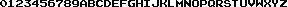
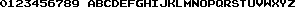
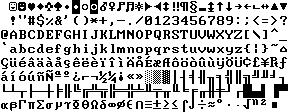

# Optimizing size of images for #js13k

## Summary

Original images are converted with https://tinypng.com/

0-9, A-Z characters

| file       | original |   tiny   |
|------------|----------|----------|
|8x7-nospace |    452 B |    276 B |
|7x7-nospace |    436 B |    324 B |
|8x8         |    671 B |    286 B |

ASCII table

| file       | original |   tiny   |
|------------|----------|----------|
|ascii       |   2693 B |   1889 B |

## Details

### 8 x 7 px; without space character

original - 452 B

tiny - 276 B

### 7 x 7 px; withut space character

original - 436 B

tiny - 324 B

### 8 x 8 px; with space character

original - 671 B

tiny - 286 B

### 8 x 8 px; ASCII

original - 2693 B

tiny - 1889 B

